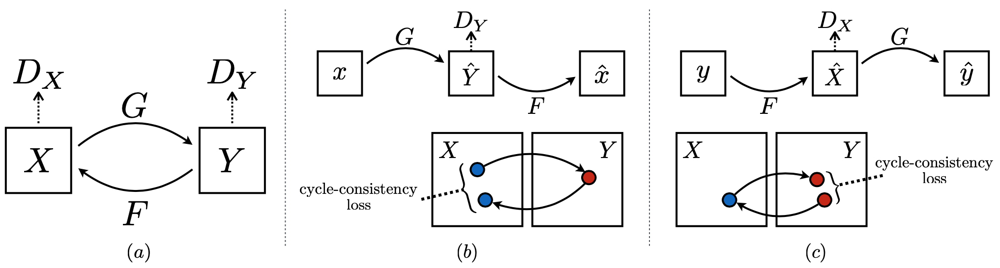
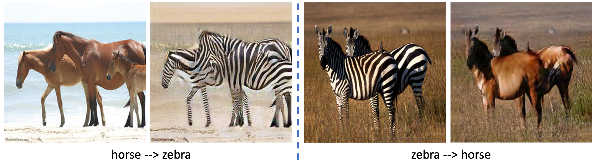

# CycleGAN

A PyTorch implementation of CycleGAN based on ICCV 2017 paper [Unpaired Image-to-Image Translation using Cycle-Consistent Adversarial Networks](https://arxiv.org/abs/1703.10593).



## Requirements

- [Anaconda](https://www.anaconda.com/download/)
- [PyTorch](https://pytorch.org)

```
conda install pytorch=1.7.1 torchvision cudatoolkit=11.0 -c pytorch
```

## Dataset

[monet2photo](https://people.eecs.berkeley.edu/~taesung_park/CycleGAN/datasets/monet2photo.zip)
dataset is used in this repo, you could download this dataset from official website. The data 
directory structure is shown as follows:

 ```
├──data_root
   ├── train
       ├── A (domain A images)
       ├── B (domain B images) 
   ├── test
       ├── A (domain A images)
       ├── B (domain B images) 
```

## Usage

```
python main.py --data_name modal --method_name simclr --gpu_ids 0 1
optional arguments:
--data_root                   Datasets root path [default value is 'data']
--data_name                   Dataset name [default value is 'rgb'](choices=['rgb', 'modal'])
--method_name                 Method name [default value is 'umda'](choices=['umda', 'simclr', 'moco', 'npid'])
--proj_dim                    Projected feature dim for computing loss [default value is 128]
--temperature                 Temperature used in softmax [default value is 0.1]
--batch_size                  Number of images in each mini-batch [default value is 16]
--iters                       Number of bp over the model to train [default value is 40000]
--gpu_ids                     Selected gpus to train [required]  
--ranks                       Selected recall [default value is '1,2,4,8']
--save_root                   Result saved root path [default value is 'result']
--negs                        Negative sample number [default value is 4096]
--momentum                    Momentum used for the update of memory bank or shadow model [default value is 0.5]
```

## Benchmarks

The models are trained on one NVIDIA GTX TITAN (12G) GPU. `Adam` is used to optimize the model, `lr` is `1e-3`
and `weight decay` is `1e-6`. `batch size` is `16` for `umda`, `32` for `simclr` and `moco`, `64` for `npid`.
`momentum` is `0.999` for `moco`, `lr` is `1e-3` and `betas` is `(0.5, 0.999)` for Generators, `lr` is `1e-4`
and `betas` is `(0.5, 0.999)` for Discriminators, other hyper-parameters are the default values.

### RGB

<table>
<thead>
  <tr>
    <th rowspan="2">Method</th>
    <th colspan="4">Day --&gt; Night</th>
    <th colspan="4">Night --&gt; Day</th>
    <th colspan="4">Day &lt;--&gt; Night</th>
    <th rowspan="2">Download</th>
  </tr>
  <tr>
    <td align="center">R@1</td>
    <td align="center">R@2</td>
    <td align="center">R@4</td>
    <td align="center">R@8</td>
    <td align="center">R@1</td>
    <td align="center">R@2</td>
    <td align="center">R@4</td>
    <td align="center">R@8</td>
    <td align="center">R@1</td>
    <td align="center">R@2</td>
    <td align="center">R@4</td>
    <td align="center">R@8</td>
  </tr>
</thead>
<tbody>
  <tr>
    <td align="center">NPID</td>
    <td align="center">8.00</td>
    <td align="center">9.33</td>
    <td align="center">10.67</td>
    <td align="center">14.67</td>
    <td align="center">8.00</td>
    <td align="center">9.33</td>
    <td align="center">10.67</td>
    <td align="center">12.00</td>
    <td align="center">3.33</td>
    <td align="center">6.00</td>
    <td align="center">6.67</td>
    <td align="center">8.00</td>
    <td align="center"><a href="https://pan.baidu.com/s/1Y9shBKadeBhkifopHexioA">r2bg</a></td>
  </tr>
</tbody>
</table>

## Results

